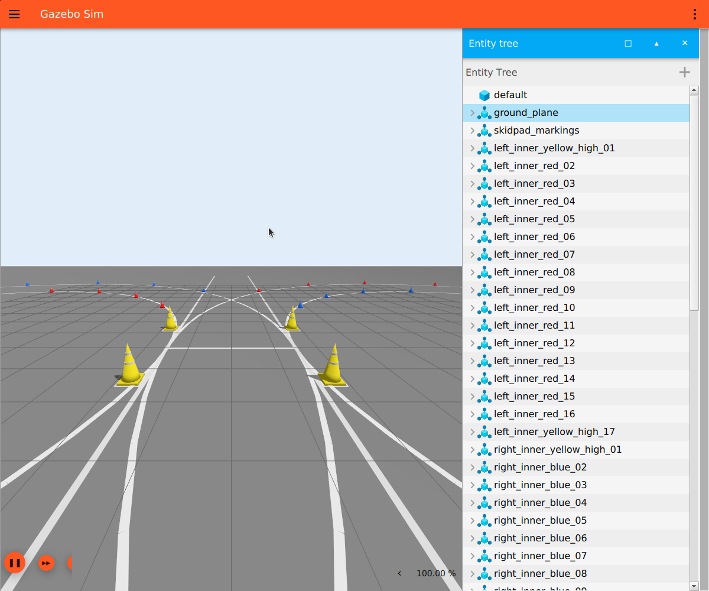
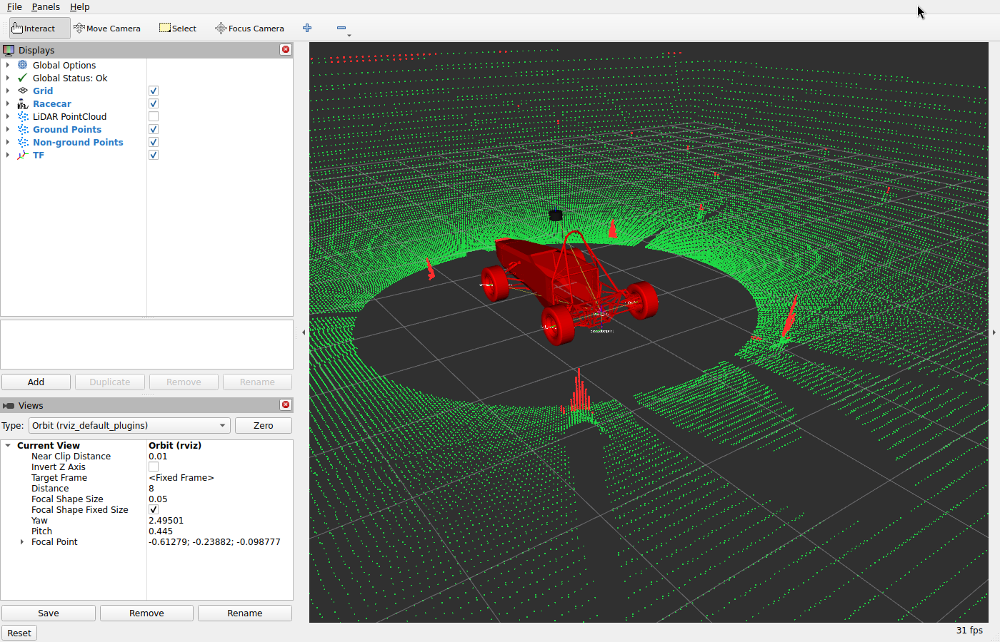
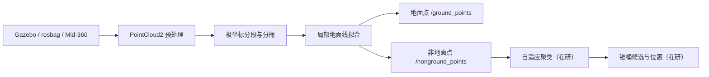

# Fast Segmentation of 3D Point Clouds for Ground Vehicles

面向大学生无人驾驶方程式赛车（FSAC）的实时 LiDAR 地面分割系统。项目基于
**ROS 2 Jazzy、PCL 与 Gazebo Harmonic**，将原始三维点云划分为地面点和非地面点，
为锥桶检测、定位与规划提供更干净的前景数据。

项目同时支持 Gazebo 仿真、rosbag 回放与 Livox Mid-360 实机输入；算法节点通过标准
`sensor_msgs/msg/PointCloud2` 接口与数据源解耦。

## 运行效果

下图均由本仓库当前版本实际运行后截取。

<table>
  <tr>
    <td width="50%" align="center">
      
      <br />
      <b>Gazebo Harmonic 联合仿真</b><br />
      FSAC 滑移圆环赛道、彩色锥桶与联合仿真环境
    </td>
    <td width="50%" align="center">
      
      <br />
      <b>RViz2 地面分割结果</b><br />
      绿色为地面点，红色为去除地面后保留的非地面点
    </td>
  </tr>
</table>

从 RViz2 结果可以看到，赛道平面被归入 `/ground_points`，赛车、锥桶及其他高于局部
地面的结构被保留在 `/nonground_points` 中。后者可直接作为后续聚类和目标检测的输入。

## 项目亮点

- **局部地面建模**：按水平角划分扇区，在各扇区的距离桶中提取最低点并拟合分段地面线；
- **适应起伏路面**：使用多段局部直线而非单一全局平面，兼顾坡度变化与计算效率；
- **数据源解耦**：同一算法可处理 Gazebo、rosbag 和 Livox Mid-360 点云；
- **结果可观测**：发布地面、非地面、ROI 过滤结果与距离桶最低点，便于 RViz2 调参与排查；
- **完整仿真闭环**：包含 FSAC 赛车模型、滑移圆环赛道、128 线 LiDAR、ROS-Gazebo 桥接、
  Ackermann 运动与键盘遥控；
- **容器化复现**：算法和仿真分别运行在 Docker 容器中，通过 ROS 2 DDS 通信。

## 系统架构



地面分割的核心流程如下：

1. 删除 NaN/Inf，并按距离和高度裁剪感兴趣区域；
2. 根据水平角将点云划分为多个扇区，再按径向距离分桶；
3. 提取每个距离桶中的最低点；
4. 在各扇区内拟合多段局部地面线 `z = ar + b`；
5. 根据点到对应地面线的距离完成地面/非地面分类。

## 快速开始

### 环境要求

- Ubuntu 24.04；
- Docker Engine 与 Docker Compose V2；
- 支持 X11 的桌面环境；
- NVIDIA GPU、驱动及 NVIDIA Container Toolkit（当前 `compose.yaml` 默认启用 GPU）。

### 一键启动联合仿真

在项目根目录执行：

```bash
./scripts/run_simulation.sh
```

脚本会依次完成 X11 授权、容器启动、工作区增量编译，并打开 Gazebo、RViz2、地面分割
节点和键盘控制。首次构建镜像耗时取决于网络和主机性能。

键盘控制：

| 按键 | 功能 |
| --- | --- |
| `↑` / `↓` | 加速前进 / 减速并倒车 |
| `←` / `→` | 左转 / 右转 |
| `C` | 转向回中 |
| `Space` 或 `S` | 停车 |
| `Q`、`Esc` 或 `Ctrl+C` | 停车并退出 |

### 手动启动

启动并进入容器：

```bash
docker compose up -d --build algorithm simulation
docker compose exec algorithm bash
docker compose exec simulation bash
```

编译地面分割包：

```bash
cd /Fast_Segmentation_of_3D_Point_Clouds_for_Ground_Vehicles/Fast_Segmentation_ws
source /opt/ros/jazzy/setup.bash
colcon build --symlink-install --packages-select fast_ground_segmenter
source install/setup.bash
```

编译仿真包：

```bash
cd /Fast_Segmentation_of_3D_Point_Clouds_for_Ground_Vehicles/simulation_ws
source /opt/ros/jazzy/setup.bash
source ../Fast_Segmentation_ws/install/setup.bash
colcon build --symlink-install --packages-select racecar_description racecar_gazebo
source install/setup.bash
```

在加载两个工作区后启动联合仿真：

```bash
ros2 launch racecar_gazebo simulation.launch.py
```

无桌面环境时可关闭 Gazebo GUI 和 RViz2：

```bash
ros2 launch racecar_gazebo simulation.launch.py \
  gui:=false headless:=true rviz:=false
```

## 接入 rosbag

仅启动地面分割节点：

```bash
ros2 launch fast_ground_segmenter fast_ground_segmenter_bringup.launch.py \
  input_topic:=/sensing/lidar/top/rectified/pointcloud \
  use_sim_time:=true
```

在另一终端播放数据：

```bash
ros2 bag play /data/<bag_name> --loop --clock
```

如 rosbag 的点云话题不同，只需修改 `input_topic`，无需改动算法代码。

## 接入 Livox Mid-360

项目包含 Livox SDK2、Livox ROS Driver 2、地面分割和 Foxglove Bridge 的一键启动流程：

```bash
./scripts/run_mid360.sh
```

默认配置为：

```text
主机网卡：eno1
主机地址：192.168.1.50
雷达地址：192.168.1.133
Foxglove：ws://localhost:8765
```

使用其他网卡或地址时请先查看参数：

```bash
./scripts/run_mid360.sh --help
```

雷达应使用官方转接线和独立 9–27 V 直流供电，RJ45 仅传输数据，请勿接入 PoE 供电设备。

## ROS 2 接口

节点名称：`ground_segmenter_node`

| 话题 | 类型 | 说明 |
| --- | --- | --- |
| 参数 `input_topic` | `sensor_msgs/msg/PointCloud2` | 原始 LiDAR 点云输入 |
| `/ground_points` | `sensor_msgs/msg/PointCloud2` | 分类后的地面点 |
| `/nonground_points` | `sensor_msgs/msg/PointCloud2` | 去除地面后的前景点 |
| `/debug/filtered_points` | `sensor_msgs/msg/PointCloud2` | ROI 过滤后的点云 |
| `/debug/bin_min_points` | `sensor_msgs/msg/PointCloud2` | 各极坐标距离桶的最低点 |

所有点云订阅和发布均使用 `rclcpp::SensorDataQoS()`，输出保留输入消息的时间戳和
`frame_id`。

## 主要参数

仿真配置位于
`Fast_Segmentation_ws/src/fast_ground_segmenter/config/gazebo_ground_segmenter.yaml`。

| 参数 | 默认值（Gazebo） | 说明 |
| --- | ---: | --- |
| `min_range` / `max_range` | `1.0` / `50.0` m | 径向处理范围 |
| `min_z` / `max_z` | `-2.0` / `1.0` m | 高度 ROI |
| `num_segments` | `360` | 水平角扇区数 |
| `num_bins` | `120` | 每个扇区的距离桶数 |
| `max_slope_deg` | `10.0`° | 允许的最大地面坡度 |
| `max_fit_error` | `0.15` m | 地面线拟合误差上限 |
| `max_point_to_line_distance` | `0.20` m | 点到地面线的分类阈值 |

rosbag、Gazebo 和 Mid-360 使用独立参数文件，便于针对传感器扫描方式、安装高度及场景
分别调参。

## 项目结构

```text
.
├── Fast_Segmentation_ws/
│   └── src/
│       ├── fast_ground_segmenter/  # 地面分割节点、配置与测试源文件
│       └── cone_detection/         # 锥桶检测的在研模块
├── simulation_ws/
│   └── src/
│       ├── racecar_description/    # 赛车、LiDAR、锥桶模型与 RViz 配置
│       └── racecar_gazebo/         # 赛道、桥接、启动与键盘遥控
├── docker/                          # ROS 2 Jazzy 算法/仿真镜像
├── scripts/                         # 仿真与 Mid-360 一键启动脚本
├── docs/images/                     # README 实际运行截图
└── compose.yaml
```

## 当前状态

- [x] 点云清洗、ROI 过滤和 PCL 转换；
- [x] 极坐标分段、距离分桶与最低点提取；
- [x] 局部地面线拟合及地面/非地面分类；
- [x] Gazebo 128 线 LiDAR、ROS 2 桥接与 RViz2 可视化；
- [x] Ackermann 车辆运动与键盘控制；
- [x] Livox Mid-360 驱动与可视化启动链路；
- [ ] 将现有地面分割测试源文件接入 CMake/colcon；
- [ ] 完成坡道、起伏路面和动态场景的定量验收；
- [ ] 完成锥桶重建、几何过滤和位置发布。

> 当前截图用于展示功能链路和可视化效果，不代表准确率或实时性基准。锥桶检测模块仍在
> 开发中，当前稳定交付范围是地面分割、仿真联动与 Mid-360 接入。

## 调试建议

RViz2 中建议使用以下配色，并将点云 QoS 设置为 `Best Effort / Volatile`：

| 点云 | 建议颜色 |
| --- | --- |
| 原始点云 `/lidar/points` | 灰色 |
| ROI 点云 `/debug/filtered_points` | 白色 |
| 距离桶最低点 `/debug/bin_min_points` | 蓝色 |
| 地面点 `/ground_points` | 绿色 |
| 非地面点 `/nonground_points` | 红色 |

常用检查命令：

```bash
ros2 topic hz /lidar/points
ros2 topic hz /ground_points
ros2 topic hz /nonground_points
ros2 topic echo /lidar/points --once --field fields
```
